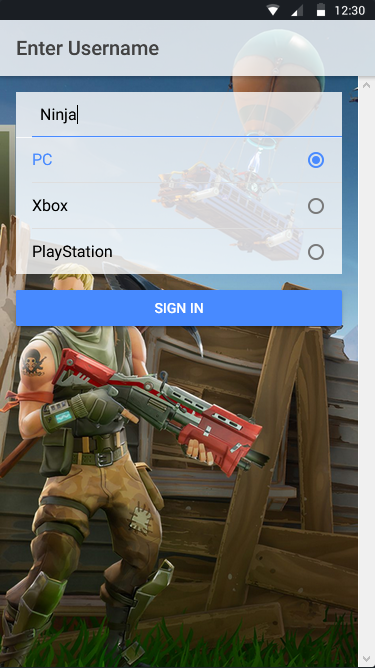

# fortnite-stats

In this Ionic project I am using APIs provided by https://fortnitetracker.com/site-api.

Fortnite is currently the most played game with over 250 million players, so I see a good opportunity in making a stats tracking application.

To see the application in action you need to use your own 'TRN-Api-Key' that you can get from https://fortnitetracker.com/site-api.

## Screenshots

